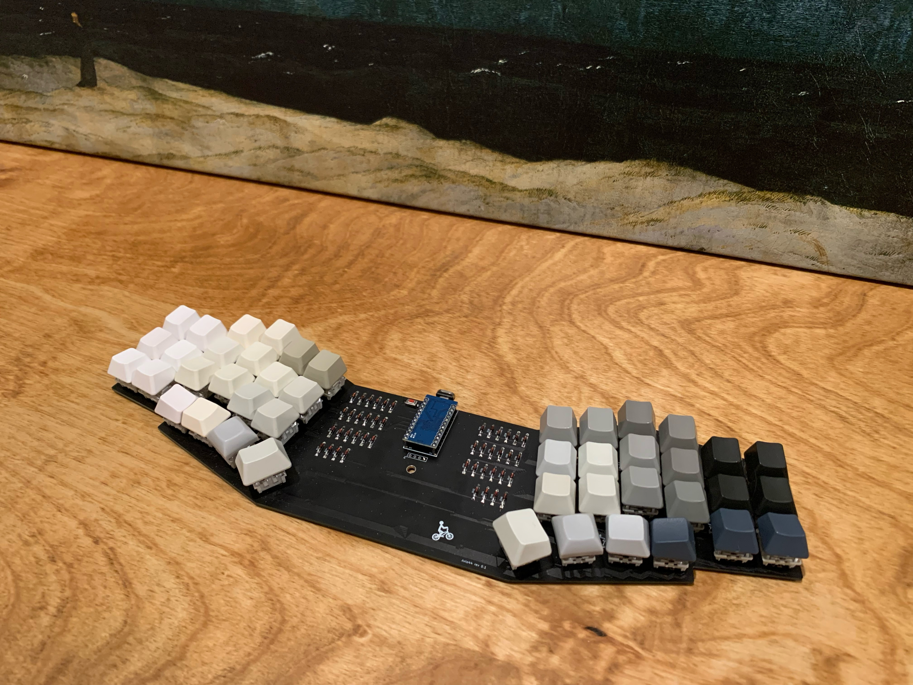
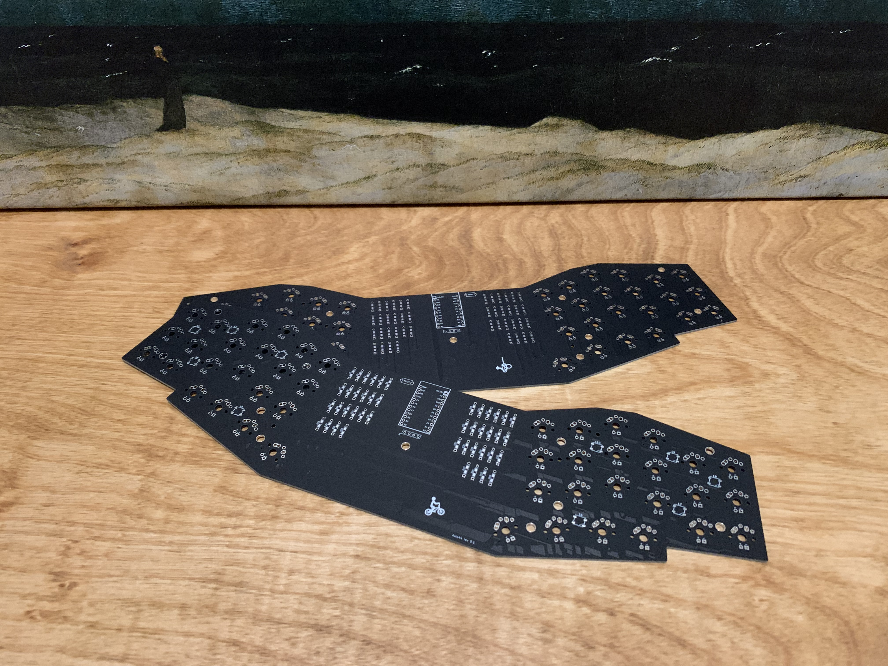

# Avlo44 Keyboard

Avlo44 is a 6x3+4 column-staggered, split, unibody keyboard. 

Inspired by the [Kyria](https://blog.splitkb.com/blog/introducing-the-kyria), 
[Reviung41](https://github.com/gtips/reviung) and [Lily58](https://github.com/kata0510/Lily58), it was designed with the following goals in mind:

* **Goal**: Easy to carry around the office with my laptop when I have meetings.
  * *Choice*: Unibody design. I like split keyboards, but they can be awkward to pick up and carry around.
  * *Choice*: Wireless. I intend to install a [nice!nano](https://nicekeyboards.com/nice-nano/) on the board eventually.
* **Goal**: Minimize keymap customization and learning curve for everyday office work and programming.1
  * *Corollary*: This means 3x6 with dedicated keys for all Mac modifiers. I don't find a worthwhile tradeoff in fewer keys.
  * *Choice*: 44 keys in a 6x3+4 layout.
* **Goal**: Experiment with an aggressive column-stagger, especially for the pinky. This seems intuitive to me, given my pinky is significantly shorter than other fingers.
  * *Choice*: The column-stagger is lifted directly from the [Kyria](https://blog.splitkb.com/blog/introducing-the-kyria). All credit to [Thomas Baart](https://thomasbaart.nl/) for its design.
* **Goal**: Ease of assembly
  * *Choice*: Through-hole diodes were used instead of surface-mount. Initial revisions still have surface-mount LEDs because I didn't care enough about backlighting to invest additional effort into them.
* **Goal**: Fun stuff!
  * *Choice*: I included an OLED, which has always been more fun than functional for me, because it's relatively easy. I will probably add a rotary encoder in a follow-up revision.

Future plans:
* 4x6 variant:
  * I have a PC used mostly for gaming. I'd like a dedicated number row for this1 paired with the aggressive column-stagger.
* Breakaway sixth columns (for a 3x5 variant), as requested by someone when I first posted the Avlo44.
* Choc switch support, as requested by someone when I first posted the Avlo44.
* As mentioned above, I'd like to experiment with a rotary encoder.

## Footnotes

1 In my experience, there is an inflection point as one reduces the number of keys, where there is a drastic increase in the complexity of keymap customizations (combos, layers, mod-taps, etc.) I think this inflection point depends on application: general office work versus programming versus gaming. In all cases, moving beyond it requires significantly more time/energy to adapt, tune, etc. 
